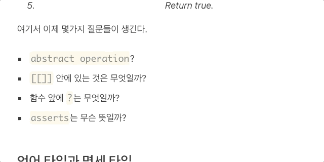

## 크롬 익스텐션 - 다음 영한사전

찾고자 하는 단어를 더블클릭으로 선택해주세요. 단어의 뜻을 현재 마우스 위치에서 보여줍니다.

## How to install

1. https://github.com/yceffort/chrome-extension-daum-en-ko-dictionary/releases/ 에서 최신파일을 받아주세요.
2. 주소창에 `chrome://extensions`을 입력하고 엔터를 눌러주세요.
3. 우 상단의 개발자 모드를 활성화해주세요.
4. 1에서 받은 파일을 압축 해제하고, `압축해제된 확장 프로그램을 로드합니다.`를 눌러서 해당 폴더를 선택해주세요.
